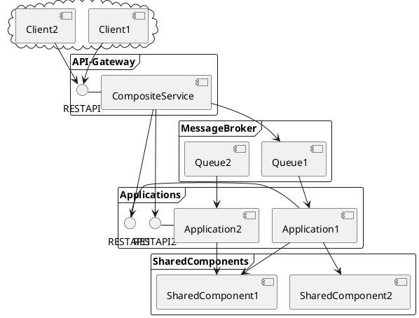
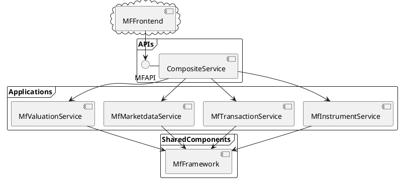

## APIs  ##

Die von der MyFinance Infrastruktur bereitgestellten Funktionalitäten und werden über APIs zugänglich gemacht. Eine API bündelt eine fachliche und/oder technische Menge von Funktionen, mit denen der Funktionsumfang einer Anwendung möglichst vollständig und kontrolliert über standardisierte Schnittstellen zugänglich gemacht wird. Alle APIs werden über ein zentrales API-Gateway zur Verfügung gestellt, um eine zentrale Stelle zu haben in der API-Versionierung, Security etc. bearbeitet wird.
Das API-Gateway leitet synchrone Abfragen an die APIs der jeweiligen fachlichen Services weiter. Asynchrone abfragen werden über einen MessegeBroker zur Entkopplung geleitet.

### Synchrone vs Asynchrone Kommunikation

Synchrone Kommunikation über Rest-APIs wird nur für User-Abfragen verwendet bei denen eine sofortige Antwort erwartet wird. API-Aufrufe wie das Speichern von Instrumenten oder das Starten von Jobs., bei denen eine höhere Laufzeit angenommen wird so dass der User nur eine Bestätigung möchte dass die Anfrage entgegengenommen wurde, nicht aber das sofortige Ergebnis, werden Asynchron entkoppelt. 

### Implementierte APIs

Es existieren aktuell folgende APIs, die produktiv genutzt werden:

## coding conventions for Rest:

### When should you use Path Variable, and how about Query Parameter?

If you want to identify a resource, you should use Path Variable. But if you want to sort or filter items, then you should use query parameter.
/users # Fetch a list of users
/users?occupation=programer # Fetch a list of programer user
/users/123 # Fetch a user who has id 123

### Response

in case of an error throw a runtime exception -> a http 500 message will be sent with the exception and the client know what happens

In case of success without a returnvalue: Response.ok().build();

Allways return the type "response" and convert the returnvalue to json Response.ok(LeafResource.SerializeToJSON("test")).build();
If you return a String you will get "can't parse JSON.  Raw result:"

Return value type should allways(if you use the Get methode) inherit from LeafResource to get the url and data embedded in the response json

[[Events.canvas|Events]]